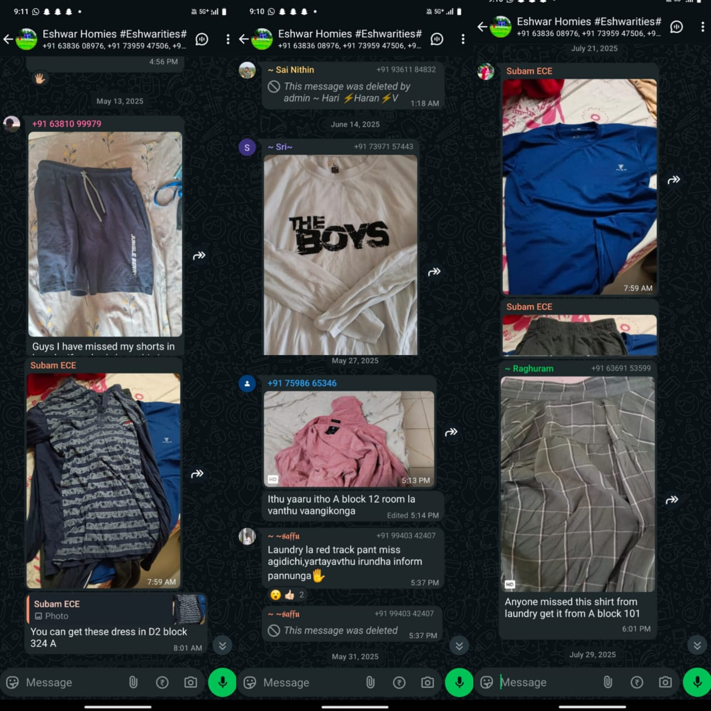
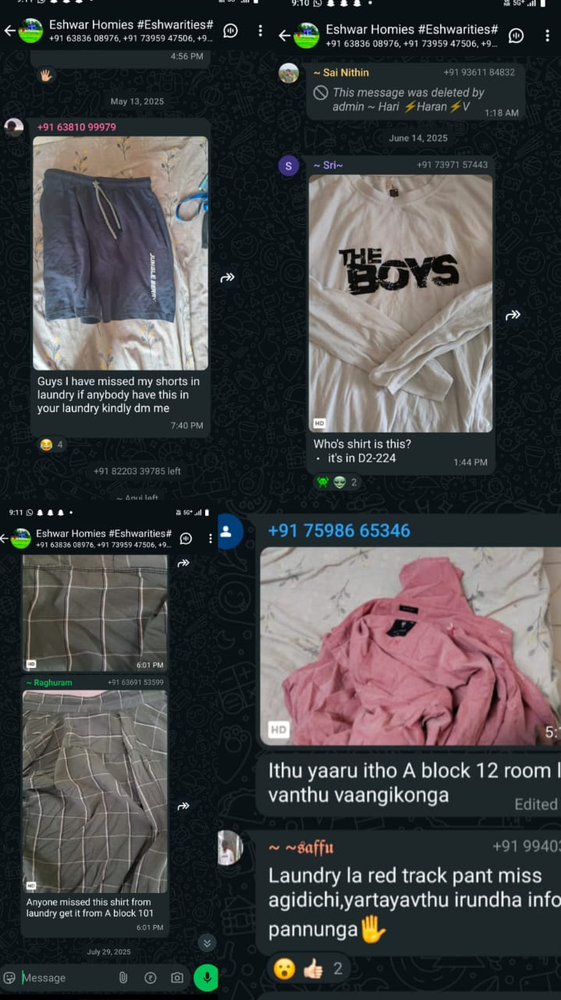
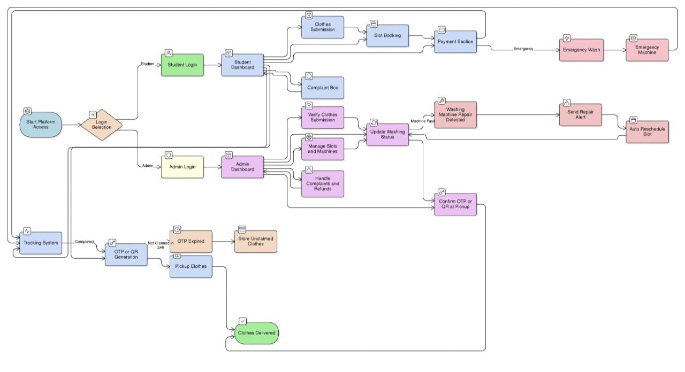

# 🧺 Laundry System with Integrated Lost & Found Portal

### 💻 Team Name: *Streak Freaks*

👥 *Team Members:*

* Naren Krishna Perumal A
* Aswin M S
* Aishwarya S R
* Sowbarnika M

---

## 🧩 Problem Description

Hostel laundry systems are outdated and messy.

* Manual process → delays & confusion
* No live tracking → zero transparency
* Lost/mixed-up clothes → no proper recovery
* No Lost & Found system → trust issues
* Admins struggle with tracking, payments & reports

---

## 🔍 Research

📸 Screenshots uploaded below — showing real student complaints from hostel WhatsApp groups.
We found:

* No digital tracking system
* Lack of accountability
* Manual logs causing mix-ups

🖼 *Screenshots:*

* 
* 

---

## 💡 Our Solution

We built a *Smart Laundry Management System* with:

* 🧑‍🎓 Student & 👨‍💼 Admin dashboards
* 📅 Slot booking (like cinema seats)
* 👕 Service selection (Wash / Iron / Emergency)
* 💸 Online & offline payments
* 🔐 OTP/QR-based pickup confirmation
* 🧭 Real-time tracking (Pending → Washing → Done)
* 🧳 Integrated Lost & Found portal for recovery

---

## ⚙ Tech Stack

Frontend: React.js + Tailwind CSS  
Backend: Firebase  
Database: MongoDB  
Authentication: Firebase Auth  
Deployment: Vercel / Netlify

---

## 🧭 System Workflow

📊 System flow diagram uploaded below —
Shows process from student login → slot booking → washing → delivery → OTP verification.

🖼 *Workflow Diagram:*

---

## 🎥 Demo Video

🎬 [Watch Demo Here](./assets/demo/laundry_demo.mp4)

---

## 🔐 Security & Smart Features

* OTP / QR-based confirmation for each delivery
* Secure hash-based authentication
* Auto machine-failure alerts
* Complaint tracking & resolution

---

## 📈 Impact in Our College

* ✅ Reduces lost clothes by 90%
* ⚡ Saves hours of student time weekly
* 🤝 Builds trust between laundry staff & students
* 💼 Streamlines management for hostel admins

---

## 🚀 Future Enhancements

* 2FA-secured login
* AI-based laundry load prediction
* RFID integration for item tracking
* Upgrade tech stack for scalability

---

## 🏁 Conclusion

> Smart Laundry isn’t just about clean clothes — it’s about clean management. ✨
> Our platform bridges the gap between *students, staff, and admins*, ensuring a transparent, secure, and efficient laundry experience.

---

## 👨‍💻 Team Streak Freaks

💥 Innovating campus life, one project at a time!

---
